# Lecture3

## Shadow Mapping

存在问题：

**自遮挡**

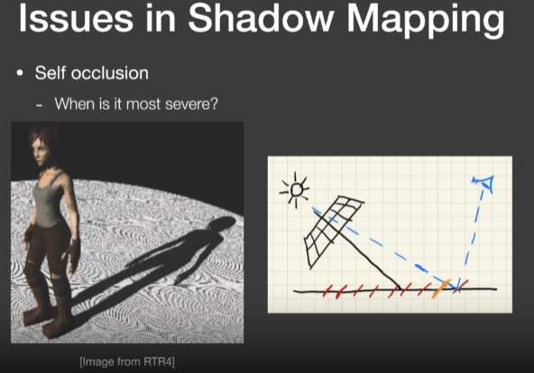

由于场景投影到光源计算的深度时，其深度图是离散的像素点，对于单个像素存储了显示场景中类似于一条正方体射线的深度，其中一个值直接表示了一个小平面深度。从而产生自模糊。

**解决方式**

通过加上一个bias去调整实际深度

**走样**

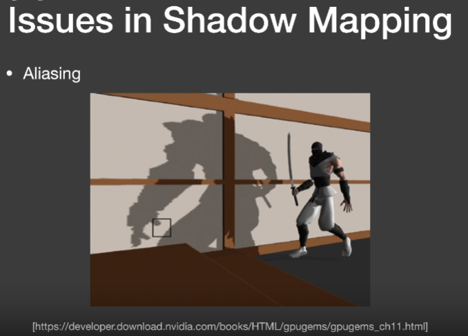

## Second-depth shadow mapping

存阴影贴图时不仅仅存最小的深度，同时存储第二小深度，并将最小深度和第二小深度平均计算中间深度当作阴影贴图。

存在问题：

1. 模型需要有两个面，不能像地板

2. 需要计算多次深度，虽然时间复杂度还是O(n)，但依旧难以应用到实时

   

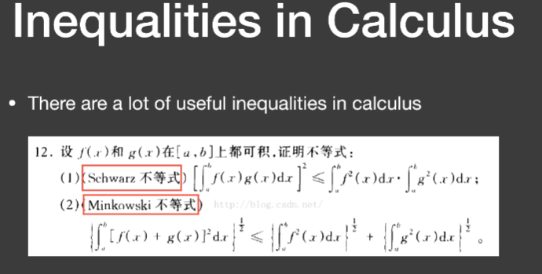

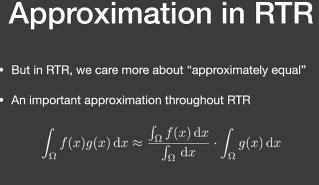

下面一项是归一化常数

比如f(x)函数为2的常值函数，可以把2提出积分，从而下面的归一化常数为2

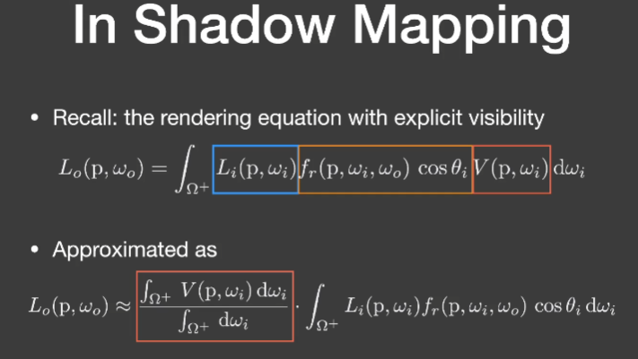

什么时候积分是可以近似的

1. 其积分的区域很小，如点光源或者直接光照
2. 另外后面的积分项是平滑的积分，如面光源

## PCSS(Percentage closer soft shadows)

### Percentage Closer Filtering(PCF)

使用了一种抗锯齿技术，同时可被用于生成软阴影

在PCSS中这种Filter并不是使用在以下两种过程中

1. 并不使用在最后生成场景阶段，并不是完全生成完包含阴影的场景，然后进行模糊
2. 并不使用在生成阴影贴图阶段

### PCSS具体做法

#### 第一步

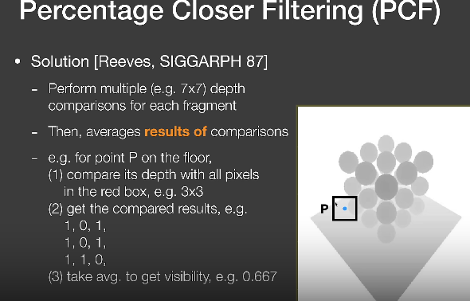

生成阴影贴图阶段不变

在进行阴影渲染过程中，原先ShadowMapping，对于任意渲染点获取该渲染点到光源的深度，也就是提取深度图中一个的值，PCSS不再仅仅考虑深度图中的一个像素值（图中蓝点），而是找该点周围一圈的像素，比如找7*7的每一个像素区域，每一个深度都进行比较，然后将这些值进行平均，从而获取到一个在0到1之间的可视值。

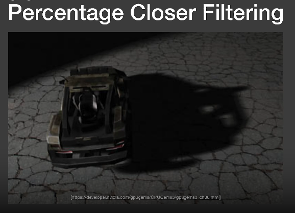

缺点：每个着色点都需要进行多次深度比较

**过滤区域大小的影响**

过小会导致过于尖锐类似于正常的Shadowmapping

过大会导致阴影过于平滑，糊在一起

#### 第二步

观察什么地方生成使用硬阴影，什么时候使用软阴影，软阴影的过滤大小在不同地方应该怎么设置

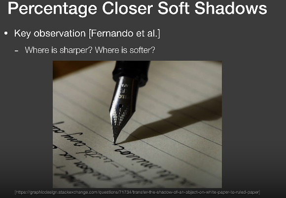

可以看出软阴影和硬阴影与遮挡物的距离有关

从而得到

**过滤大小与遮挡物距离有关**

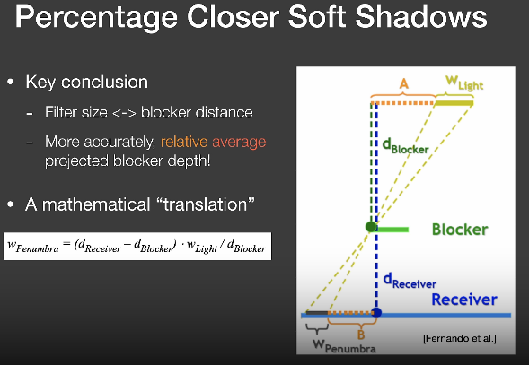

**从而过滤大小与光源大小以及遮挡物距离有关**

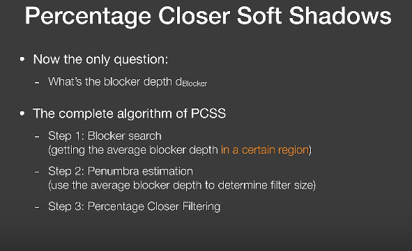

**从而PCSS的整体步骤为**

1. 首先计算遮挡物（blocker）到渲染点的具体距离
2. 使用平均的的遮挡物深度以及光源大小决定过滤器大小
3. 进行PCF操作

其中第一步具体为：

从渲染点连向点光源，取其中一个区域，判断是否在阴影中，若在阴影中，那么那个像素一定是个遮挡物，然后记录遮挡物深度

那么第一步的遮挡物怎么找到需要取多大的区域？

第一种方法：通常取5*5的区域

第二种方法

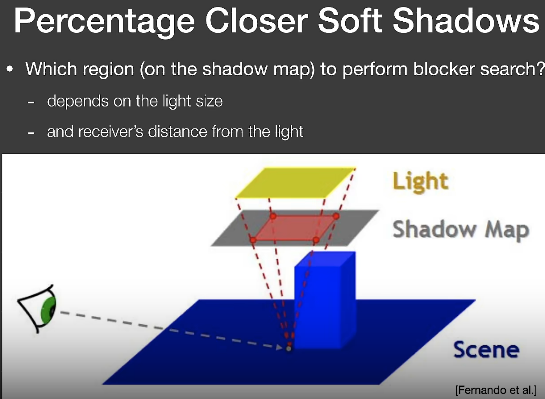

通过渲染点与光源连线

# Lecture4

PCF的数学形式

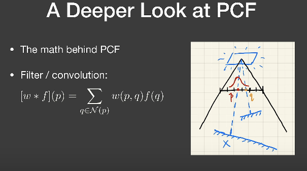

下面属于N（p）表示点P周围的点

那么PCSS的符号表示方式

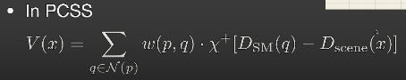

其中x+那个符号为取0或1函数，如果里面大于0那么最终值为1，如果小于0位最终值为0

所以PCF不是对shadowmap进行模糊操作也不是在模型图像上进行模糊操作

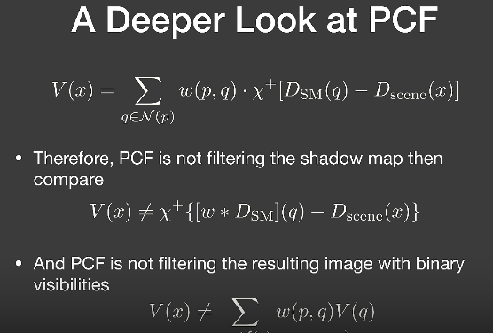

