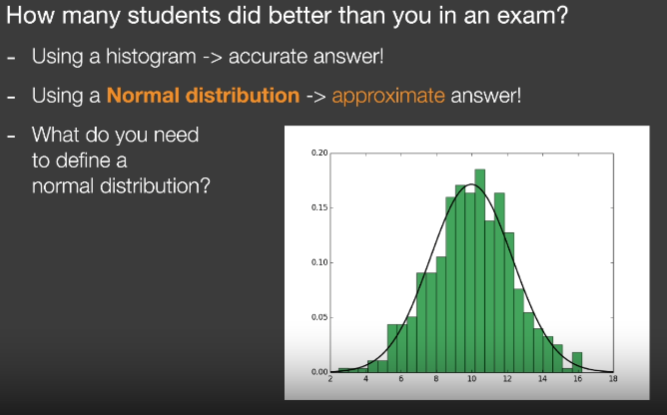
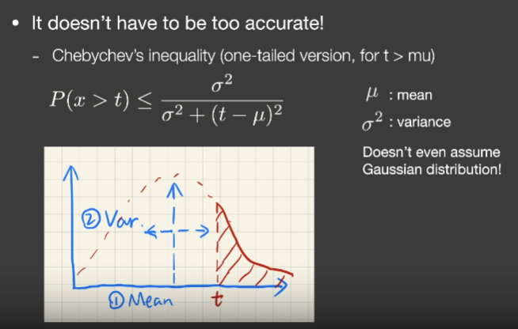

# Lecture3

## Shadow Mapping

存在问题：

**自遮挡**

由于场景投影到光源计算的深度时，其深度图是离散的像素点，对于单个像素存储了显示场景中类似于一条正方体射线的深度，其中一个值直接表示了一个小平面深度。从而产生自模糊。

**解决方式**

通过加上一个bias去调整实际深度

**走样**

## Second-depth shadow mapping

存阴影贴图时不仅仅存最小的深度，同时存储第二小深度，并将最小深度和第二小深度平均计算中间深度当作阴影贴图。

存在问题：

1. 模型需要有两个面，不能像地板

2. 需要计算多次深度，虽然时间复杂度还是O(n)，但依旧难以应用到实时

   

下面一项是归一化常数

比如f(x)函数为2的常值函数，可以把2提出积分，从而下面的归一化常数为2

什么时候积分是可以近似的

1. 其积分的区域很小，如点光源或者直接光照
2. 另外后面的积分项是平滑的积分，如面光源

## PCSS(Percentage closer soft shadows)

### Percentage Closer Filtering(PCF)

使用了一种抗锯齿技术，同时可被用于生成软阴影

在PCSS中这种Filter并不是使用在以下两种过程中

1. 并不使用在最后生成场景阶段，并不是完全生成完包含阴影的场景，然后进行模糊
2. 并不使用在生成阴影贴图阶段

## VSSM Variance Soft Shadow Mapping

针对PCSS第一步和第三步需要对Texture进行多次采样慢的问题

#### 针对第三步加速解决方案

问题转换：在第三步中需要对一个区域内的采样点比较深度值并计算平均的0-1之间的一个值，那么从另一个角度上看，是为了求比中间采样点深度值低的点（一定区域就是指采样深度值的区域）

怎么获取得知比已知深度值更低的结果

使用直方图或正态分布可以近似估计可以研究该深度值在所有深度值大概排第几。

正态分布如何获得？需要均值以及期望方差

**VSSM基本思想是**：

​	**使用正态分布区估计该深度值所在区域内的所在位置（或者使用其他分布）**

##### 使用正态分布去估计

###### 步骤一求解正态分布

​	**为求解正态分布需要在一定区域内快速计算深度的均值以及方差。**

如何求解均值方法可以使用

1. ​	**硬件的MipMAPing方法**
2. ​	**Summed Area Tables(SAT)**

如何求解方差可以使用

1. $$
   Var(X)=E(X^2)-E^2(X)
   $$

   E(X)指的就是该区域的深度平均值

   前面一项的计算需要另一张深度图，深度图中每一个值是原深度图的平方倍（可以将另一张深度图生成到另一个图象通道中）成为square-depth map

   

###### 步骤二使用CDF估计所在位置

在的到CDF图后，那么问在一个区域内深度值比1(中间像素)小的像素应该有多少个

也就是CDF函数小于1的面积，可通过将CDF转换为PDF求解

对于CDF的面积可以直接使用表(误差函数)去获取

##### 另一种方法使用切比雪夫不等式直接估计

使用不等式Chebychev不等式(切比雪夫不等式)

可以的到随机变量，超过某一个值得概率，但又不需要知道这个分布是什么，只需要知道期望和方差

注意：这个t需要在均值得右边才好用

在VSSM里直接近似估计将小于等于号直接改为约定于

#### VSSM的性能

**内存消耗：**

需要一张额外的平方深度图

**计算性能：**

1. 对深度图进行一次平均O(1)
2. 对平方深度图进行平均计算O(1)
3. 切比雪夫不等式计算O(1) 是否可见

#### 针对第一步加速方案

# Lecture5

