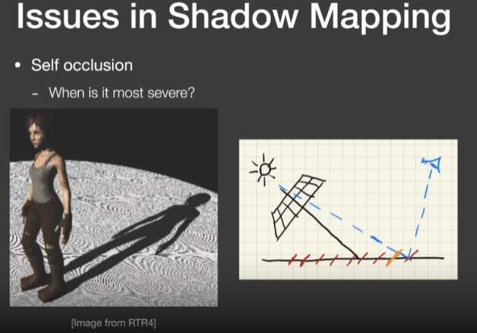
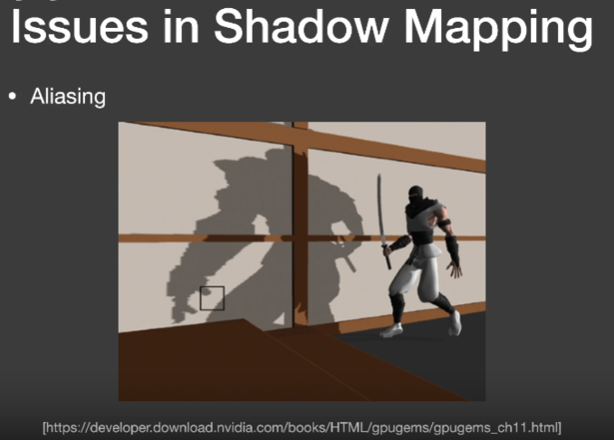
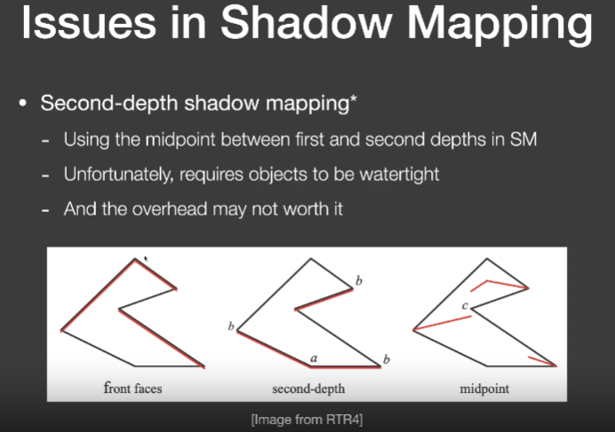
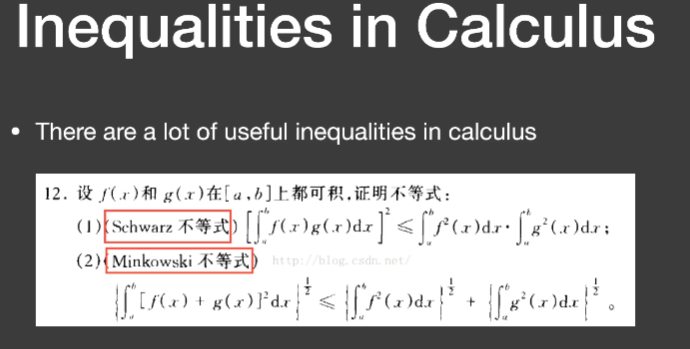
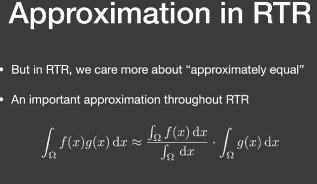
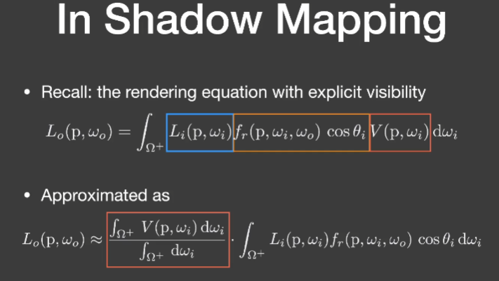

# Lecture3

## Shadow Mapping

存在问题：

**自遮挡**

由于场景投影到光源计算的深度时，其深度图是离散的像素点，对于单个像素存储了显示场景中类似于一条正方体射线的深度，其中一个值直接表示了一个小平面深度。从而产生自模糊。

**解决方式**

通过加上一个bias去调整实际深度

**走样**

## Second-depth shadow mapping

存阴影贴图时不仅仅存最小的深度，同时存储第二小深度，并将最小深度和第二小深度平均计算中间深度当作阴影贴图。

存在问题：

1. 模型需要有两个面，不能像地板

2. 需要计算多次深度，虽然时间复杂度还是O(n)，但依旧难以应用到实时

   

下面一项是归一化常数

比如f(x)函数为2的常值函数，可以把2提出积分，从而下面的归一化常数为2

什么时候积分是可以近似的

1. 其积分的区域很小，如点光源或者直接光照
2. 另外后面的积分项是平滑的积分，如面光源

## PCSS(Percentage closer soft shadows)

### Percentage Closer Filtering(PCF)

使用了一种抗锯齿技术，同时可被用于生成软阴影

在PCSS中这种Filter并不是使用在以下两种过程中

1. 并不使用在最后生成场景阶段，并不是完全生成完包含阴影的场景，然后进行模糊
2. 并不使用在生成阴影贴图阶段