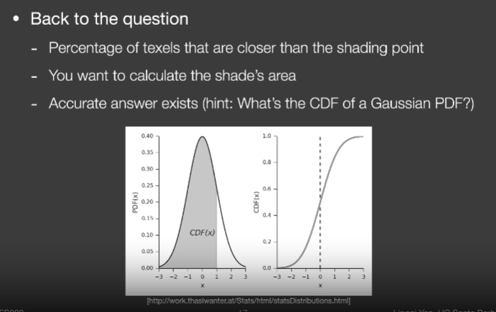
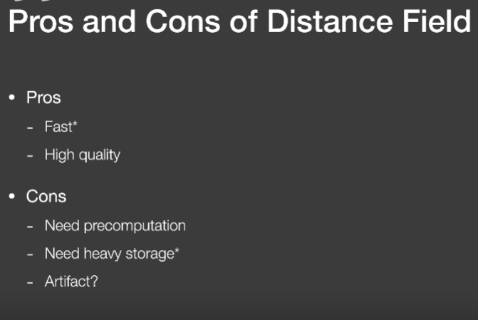
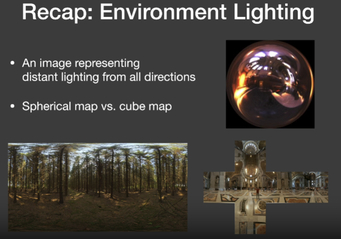

# Lecture3

## Shadow Mapping

存在问题：

**自遮挡**

由于场景投影到光源计算的深度时，其深度图是离散的像素点，对于单个像素存储了显示场景中类似于一条正方体射线的深度，其中一个值直接表示了一个小平面深度。从而产生自模糊。

**解决方式**

通过加上一个bias去调整实际深度

**走样**

## Second-depth shadow mapping

存阴影贴图时不仅仅存最小的深度，同时存储第二小深度，并将最小深度和第二小深度平均计算中间深度当作阴影贴图。

存在问题：

1. 模型需要有两个面，不能像地板

2. 需要计算多次深度，虽然时间复杂度还是O(n)，但依旧难以应用到实时

   

下面一项是归一化常数

比如f(x)函数为2的常值函数，可以把2提出积分，从而下面的归一化常数为2

什么时候积分是可以近似的

1. 其积分的区域很小，如点光源或者直接光照
2. 另外后面的积分项是平滑的积分，如面光源

## PCSS(Percentage closer soft shadows)

### Percentage Closer Filtering(PCF)

使用了一种抗锯齿技术，同时可被用于生成软阴影

在PCSS中这种Filter并不是使用在以下两种过程中

1. 并不使用在最后生成场景阶段，并不是完全生成完包含阴影的场景，然后进行模糊
2. 并不使用在生成阴影贴图阶段

### PCSS具体做法

#### 第一步

生成阴影贴图阶段不变

在进行阴影渲染过程中，原先ShadowMapping，对于任意渲染点获取该渲染点到光源的深度，也就是提取深度图中一个的值，PCSS不再仅仅考虑深度图中的一个像素值（图中蓝点），而是找该点周围一圈的像素，比如找7*7的每一个像素区域，每一个深度都进行比较，然后将这些值进行平均，从而获取到一个在0到1之间的可视值。

缺点：每个着色点都需要进行多次深度比较

**过滤区域大小的影响**

过小会导致过于尖锐类似于正常的Shadowmapping

过大会导致阴影过于平滑，糊在一起

#### 第二步

观察什么地方生成使用硬阴影，什么时候使用软阴影，软阴影的过滤大小在不同地方应该怎么设置

可以看出软阴影和硬阴影与遮挡物的距离有关

从而得到

**过滤大小与遮挡物距离有关**

**从而过滤大小与光源大小以及遮挡物距离有关**

**从而PCSS的整体步骤为**

1. 首先计算遮挡物（blocker）到渲染点的具体距离
2. 使用平均的的遮挡物深度以及光源大小决定过滤器大小
3. 进行PCF操作

其中第一步具体为：

从渲染点连向点光源，取其中一个区域，判断是否在阴影中，若在阴影中，那么那个像素一定是个遮挡物，然后记录遮挡物深度

那么第一步的遮挡物怎么找到需要取多大的区域？

第一种方法：通常取5*5的区域

第二种方法

通过渲染点与光源连线

# Lecture4

PCF的数学形式

下面属于N（p）表示点P周围的点

那么PCSS的符号表示方式

其中x+那个符号为取0或1函数，如果里面大于0那么最终值为1，如果小于0位最终值为0

所以PCF不是对shadowmap进行模糊操作也不是在模型图像上进行模糊操作

## VSSM Variance Soft Shadow Mapping

针对PCSS第一步和第三步需要对Texture进行多次采样慢的问题

#### 针对第三步加速解决方案

问题转换：在第三步中需要对一个区域内的采样点比较深度值并计算平均的0-1之间的一个值，那么从另一个角度上看，是为了求比中间采样点深度值低的点（一定区域就是指采样深度值的区域）

怎么获取得知比已知深度值更低的结果

使用直方图或正态分布可以近似估计可以研究该深度值在所有深度值大概排第几。

正态分布如何获得？需要均值以及期望方差

**VSSM基本思想是**：

​	**使用正态分布区估计该深度值所在区域内的所在位置（或者使用其他分布）**

##### 使用正态分布去估计

###### 步骤一求解正态分布

​	**为求解正态分布需要在一定区域内快速计算深度的均值以及方差。**

如何求解均值方法可以使用

1. ​	**硬件的MipMAPing方法**
2. ​	**Summed Area Tables(SAT)**

如何求解方差可以使用

1. $$
   Var(X)=E(X^2)-E^2(X)
   $$

   E(X)指的就是该区域的深度平均值

   前面一项的计算需要另一张深度图，深度图中每一个值是原深度图的平方倍（可以将另一张深度图生成到另一个图象通道中）成为square-depth map

   

###### 步骤二使用CDF估计所在位置

在的到CDF图后，那么问在一个区域内深度值比1(中间像素)小的像素应该有多少个

也就是CDF函数小于1的面积，可通过将CDF转换为PDF求解

对于CDF的面积可以直接使用表(误差函数)去获取

##### 另一种方法使用切比雪夫不等式直接估计

使用不等式Chebychev不等式(切比雪夫不等式)

可以的到随机变量，超过某一个值得概率，但又不需要知道这个分布是什么，只需要知道期望和方差

注意：这个t需要在均值得右边才好用

在VSSM里直接近似估计将小于等于号直接改为约定于

#### VSSM的性能

**内存消耗：**

需要一张额外的平方深度图

**计算性能：**

1. 对深度图进行一次平均O(1)
2. 对平方深度图进行平均计算O(1)
3. 切比雪夫不等式计算O(1) 是否可见

#### 针对第一步加速方案

第一步需要计算遮挡物的平均深度Zocc

即蓝色部分的平均深度

Key idea:

在一个渲染点的深度是t，在遮挡物区域需要计算比其小的所有像素的平均值记录为
$$
Z_{occ}
$$
不是遮挡物的平均深度记录为
$$
Z_{unocc}
$$
两个平均深度未知，但其一定满足
$$
\frac{N1}{N}Z_{unocc}+\frac{N2}{N}Z_{occ}=Z_{Avg}
$$
两个区域的平均值和等于总区域的平均值，为求解Zocc提出了两个假设：

**假设一：**使用切比雪夫去估计概率：
$$
那么\frac{N1}{N}=P可以使用切比雪夫不等式来大概估计其概率,\frac{N2}{N}=1-P
$$
**假设二：**直接人为Zunocc的深度值为渲染点的深度值。

这样可以直接求解Zocc

## 快速计算均值和方差方法

被应用于VSSM中

### 1.MINMAP

### 2.Summed Area Tables(SAT)

#### 一维情况：

给一个范围内求平均=给一个范围求总和

SAT做了预处理操作

##### 预计算过程

先花O(n)时间

将每一格累加

1：1

4:1+3

9:1+3+5

12:1+3+5+3 ...

那么给定任意一段，比如3-7-1这一段

如何知道他们三个的和

**可以使用SAT中1对应的20减去3前一个数5对应的9来的到其加和**

#### 二维情况：

对于蓝色矩形的平均值

为绿色矩形区域的和值减去两个黄色区域的和值加上左上角重叠区域(小绿色区域的和值)

##### 预计算过程

生成一张图，该图中任意一个像素点(x,y)的值为从(0,0)左上角到(x,y)像素点这个矩形区域所有像素点的和

进行两次一维SAT计算

需要时间O(mn)

## Moment shadow mapping

解决了VSSM问题

例如第二个图，不能假设维正太分布

遮挡物的分布应该聚集在一个三个峰值的分布，不能用高斯分布区近似

人们通常能融入过黑的阴影，但过白的阴影无法接受

例如加入只有百分之20的挡不住，但分布认为有百分之50挡不住

#### Idea

避免VSSM的分布问题

使用更高阶的矩去描述一个分布

矩指的是记录一个数的平方，三次方，四次方

Vssm记录了一个一次放和二次方的项。

结论如果保留m阶的矩可一个得到m/2的台阶

类似于某种展开，可以获取到更好的CDF函数，而不是正态分布

# Lecture5

## Distance Field Soft Shadows

好处：很快，不存在自遮挡，阴影悬浮

缺点：需要消耗内存，尤其是对于对象和蒙皮角色需要高分辨率内存成本

### Distance Field(functions):

定义了空间中的任意一个点，到物体表面的最小距离。距离场带正负号(有向距离)

距离函数样例：Blending一个运动边界，存在运动的两张图A和B希望插值出中间的值

每一个像素，从A和B图分别取然后求平均，如上面部分但会生成灰色的，不属于原运动模型的颜色

为此使用距离场：

定义A图，黑色都是负值，白色都为正值，同时离边界越远其值越大，B图同样

从而使用SDF距离场进行插值

重点：也就是不用考虑模型内部的参数，如颜色，法线什么的，只考虑距离关系，进行插值

### 应用场景：

#### Ray marching

用光线追踪，追踪距离场，看会达到那个表面

简要来说，为光线会与距离场定义的隐含表面求教

##### 其基本思想为：

例如从右下角初始点，发射定向光线，获取该点的SDF距离场的值，该值表示可能与任意物体的最近距离，那么从光线的定向方向出发移动这个最近距离，表示一定不可能与任意物体产生相交。

从而光线的出发点就可以达到第一个未知，图中(中间的圆点），继续获取该点的距离场值，光源继续移动安全距离，直到移动到的新点距离值足够小(表明与物体相交)，或者光线向前移动了非常远距离(表示什么东西都不相交)。

SDF除啦可以提供安全距离，还可以提供安全角度()

安全角度含义是，加入存在一个着色点，发出的光线中存在一个点，该点的SDF表示其周围多远存在物体，那么可以得到一个安全角度，在这个角度范围内都不会存在物体。

从而这个安全角度越小，能看到的东西越少，也就是没有遮挡，可见性为1

#### 那么安全角度如何得到？

##### 方案一：(较麻烦)

通过raymarching找到路径上的点，求每个点的安全角度，其中最小的安全角度就是这个着色点的安全角度

使用arcsin(SDF的值/走过的距离)

##### 方案二：

直接求SDF的值与走过距离的比值(减少arcsin函数计算)

K的作用：用来决定比值的范围，如果范围过大之间用1处理，比如k取5，那么比值小于0.2时，才有用，不然就直接按1处理。

可以用来控制软硬阴影程度

Distance Field Soft Shadows优略势

## Shading from environment light

环境光认为光照来源于无限远

使用方法为IBL

使用所有方向取渲染一个点，其中渲染方程不再需要考虑可见性

但计算蒙特卡洛时需要sampling消耗大量时间

如果是glossy的brdf球面覆盖范围很小，diffuse的覆盖范围很大，但是值很平滑

根据一个近似函数（Second-depth shadow mapping章节也有）

从而将反射方程拆分

### IBL的反射返程拆分

#### 步骤一：对光源积分进行拆分：将着色点的可视光源做一个积分，映射到IBL图中

积分的具体概念为：

在一张IBL的贴图中（可以将其视为一个圆形包裹场景的光源），考虑到一个着色点只能看到一部分区域，(类似于在IBL贴图中的一个圆形区域(对应圆形包裹光源中一个小的区域))，获取了其中的一部分区域的光照的积分并归一化，这就是一个一个着色点的获取的光照，那么所有的着色点，就是每个着色点都对应于IBL贴图中一个小的区域然后积分归一化。

通过这个思想：那么转换到IBL图中，就是将IBL贴图模糊，任意一个着色点，取这个IBL贴图中的一个区域，对这个区域进行平均处理，然后把平均值赋值到这个贴图的范围

**注意：这个过程可以预计算**，且可生成多种Filter范围的贴图

其中图越糊，说明着色点搜到的光照范围越大，也就是BRDF采取的范围越大

和阴影的区别是拆出的项不同，因为阴影主要做可见性判别，而IBL这里其可见性都存在一定为1

从这张图可以看出映射过程，先在这个外面的半圆中预计算出filter的区域光照值，每一个方向(镜面反射)上的点的值，就是所需值。

#### 步骤二：将BRDF进行拆分

##### 第一次近似：

**基本理论：也希望使用预计算计算BRDF**

**问题：使用预计算计算不同种类的颜色，以及不同粗糙度，这是一个五维的表格，维度过大**

##### Microfacet BRDF：

要点是:

1. 菲涅尔项(Fresnel term)：如果垂直的看向物体表面，物体是什么颜色，如果不垂直看向物体，物体看起来怎么样，主要决定了颜色。
2. 微表面法线分布(distribution of normals): 分布比较开，那么就是diffuss，如果比较集中，那么就是类似于镜面。

##### **近似菲涅尔项的方式（Schilcks approximation）**：

考虑到菲涅尔项在不同的入射角度下，其函数方式都类似于向上的指数函数：

因此将其近似为指数函数

**定义了一个初始值的基础反射率R0，然后定义了怎么向上长使用了**
$$
(1-cos\theta)^5
$$
其函数受到两个值影响

在光照中，很多角度基本可以近似，入射角，出射角，半角，

##### 近似微表面法线分布：

类似于高斯的分布主要受到2个值影响

1. a定义函数是胖还是瘦也就是材质是diffuse还是glossy
2. \theta也是类似于半角（通过某种近似方式都描述维入射角相关的值）

**从而BRDF可由三个值取构成**

1. 入射角度(橙色的)
2. 基础反射率
3. a值

从而可以给定三个变量预计算出一个结果

##### 第二次近似：

菲涅尔项进一步近似

对于BRDF来说将其拆分，主要是在积分里面乘以一个菲涅尔项在除以一个菲尼尔项
$$
\int_{\Omega^+} f_{r}(p,w_{i},w_{o})cos\theta_{i}dw_{i} dx=\int_{\Omega^+}\frac{f_{r}}{F}Fcos\theta_{i}dw_{i} dx\\
=
\int_{\Omega} \frac{f_{r}}{F}(R_{0}+(1-cos\theta)^5-R_{0}(1-cos\theta)^5) cos\theta_{i}dw_{i} dx\\
=\int_{\Omega} \frac{f_{r}}{F}(R_{0}-R_{0}(1-cos\theta)^5) cos\theta_{i}dw_{i} dx+
\int_{\Omega} \frac{f_{r}}{F}(1-cos\theta)^5 cos\theta_{i}dw_{i} dx\\
=R_{0}\int_{\Omega} \frac{f_{r}}{F}(1-(1-cos\theta)^5) cos\theta_{i}dw_{i} dx+
\int_{\Omega} \frac{f_{r}}{F}(1-cos\theta)^5 cos\theta_{i}dw_{i} dx
$$
这样可以将R0拆除去，从而积分不需要计算R0

这样使用Roughness和costheta取计算出一个值，代表了BRDF的值

这时候给你一个BRDF，基础反射率已知R0

这样最终只需要依赖R0当作未知量，且R0一半是一个图形的金属度可以得到

存在问题：既然是给定了一个Roughness和一个cos\theta得到了一张贴图，那么这个贴图计算过程中为什么不需要考虑RO理论上模型不同地方的金属度是不一样的，总不能模型金属度为常量。

**整个方式叫做Split Sum**方式

****